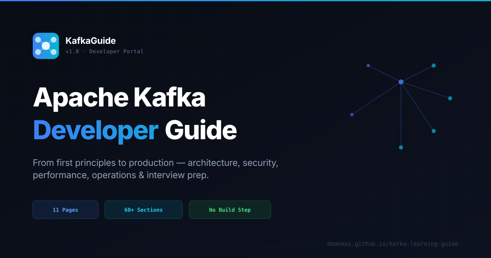

<div align="center">


# KafkaGuide

### The Complete Apache Kafka Developer Portal

**Production-ready learning for engineers building real-time data systems**

[](https://github.com/deannos/kafka-learning-guide/actions/workflows/deploy.yml)
[](https://github.com/deannos/kafka-learning-guide/releases)
[](LICENSE)
[](https://github.com/deannos/kafka-learning-guide/issues)
[](CONTRIBUTING.md)

[**Live Site →**](https://deannos.github.io/kafka-learning-guide) &nbsp;·&nbsp;
[Changelog](CHANGELOG.md) &nbsp;·&nbsp;
[Contributing](CONTRIBUTING.md) &nbsp;·&nbsp;
[Report a Bug](https://github.com/deannos/kafka-learning-guide/issues/new?template=bug_report.md) &nbsp;·&nbsp;
[Request a Feature](https://github.com/deannos/kafka-learning-guide/issues/new?template=feature_request.md)

<br/>



</div>

---

## Overview

**KafkaGuide** is a self-contained, zero-dependency developer portal for mastering Apache Kafka — from core concepts to production-grade patterns. It covers architecture internals, security, performance tuning, operations runbooks, and interview preparation, all in a fully searchable, keyboard-navigable interface.

Built with pure HTML, CSS, and vanilla JavaScript. No framework. No build step. No backend. Open any `.html` file in a browser or deploy to any static host in seconds.

---

## Table of Contents

- [Features](#features)
- [Content](#content)
- [Getting Started](#getting-started)
- [Project Structure](#project-structure)
- [Tech Stack](#tech-stack)
- [Deployment](#deployment)
- [Roadmap](#roadmap)
- [Contributing](#contributing)
- [Security](#security)
- [License](#license)

---

## Features

| Feature | Description |
|---|---|
| **⌘K Search** | Full-text search modal across 60+ indexed sections with keyboard navigation |
| **Dark / Light Theme** | System-aware theme toggle, persisted via `localStorage` |
| **Collapsible Sidebar** | Icon-only collapsed state on desktop; mobile overlay with backdrop |
| **Auto Table of Contents** | Generated per-page from headings, with scroll-tracking active link |
| **Lucide Icon System** | Inline SVG icons throughout — no icon font, no CDN dependency |
| **Mermaid Diagrams** | Architecture and roadmap diagrams rendered client-side |
| **Code Copy** | One-click copy on all code blocks with visual feedback |
| **Responsive Layout** | Fluid grid layouts tested at 375px, 768px, and 1440px |
| **Keyboard Navigation** | Full sidebar and search navigation via keyboard |
| **SEO Optimised** | Canonical URLs, OG tags, Twitter cards, Schema.org JSON-LD, sitemap |
| **PWA Ready** | Web app manifest for home-screen installation |
| **Zero Build Step** | Open `index.html` directly — no npm, no webpack, no config |

---

## Content

Eleven pages covering the complete Kafka learning journey:

### Getting Started

| Page | Description | Key Topics |
|---|---|---|
| [Home](https://deannos.github.io/kafka-learning-guide/) | Introduction to Kafka and event streaming | What is Kafka, core concepts, use-case overview |
| [Learning Roadmap](https://deannos.github.io/kafka-learning-guide/roadmap.html) | Structured path from beginner to architect | Milestones, hands-on projects, skill checkpoints |

### Core Knowledge

| Page | Description | Key Topics |
|---|---|---|
| [Architecture](https://deannos.github.io/kafka-learning-guide/architecture.html) | Internals of the distributed commit log | Brokers, topics, partitions, replication, ISR, KRaft vs ZooKeeper |
| [Advanced Concepts](https://deannos.github.io/kafka-learning-guide/advanced.html) | Production-grade Kafka patterns | EOS, transactions, Kafka Streams, Schema Registry, Connect, log compaction |
| [Security](https://deannos.github.io/kafka-learning-guide/security.html) | Securing Kafka in production | TLS, SASL/PLAIN, SASL/OAUTHBEARER, ACLs, audit logging, network isolation |

### Applied Kafka

| Page | Description | Key Topics |
|---|---|---|
| [Performance Tuning](https://deannos.github.io/kafka-learning-guide/performance.html) | Maximum throughput and low latency | Producer batching, consumer fetch, broker config, compression, JVM tuning |
| [Use Cases](https://deannos.github.io/kafka-learning-guide/usecases.html) | Real-world Kafka patterns with code | Event sourcing, CDC, microservices, fraud detection, IoT pipelines |
| [Kafka vs Others](https://deannos.github.io/kafka-learning-guide/comparison.html) | Messaging system comparison | Kafka vs RabbitMQ, Pulsar, Kinesis, Redis Streams — when to use what |
| [Operations](https://deannos.github.io/kafka-learning-guide/operations.html) | Day-to-day Kafka operations | Monitoring, consumer lag, rebalancing, scaling, disaster recovery |

### Reference

| Page | Description | Key Topics |
|---|---|---|
| [Cheatsheet](https://deannos.github.io/kafka-learning-guide/cheatsheet.html) | CLI commands and config quick reference | `kafka-topics`, `kafka-console-producer`, `kafka-consumer-groups`, configs |
| [Interview Prep](https://deannos.github.io/kafka-learning-guide/interview.html) | 13 Q&A from beginner to architect | Architecture, EOS, Streams, security, performance — with model answers |

---

## Getting Started

No installation required. Serve the directory with any static file server:

```bash
# Clone the repository
git clone https://github.com/deannos/kafka-learning-guide.git
cd kafka-learning-guide

# Serve locally — pick any option:
python3 -m http.server 8080          # Python (built-in)
npx serve .                          # Node.js
npx http-server . -p 8080            # http-server
go run golang.org/x/tools/cmd/godoc@latest -http=:8080  # Go
```

Then open [http://localhost:8080](http://localhost:8080) in your browser.

> **Tip:** Most features (search, theme, sidebar state) work even when opening `index.html` directly as a `file://` URL — no server needed.

---

## Project Structure

```
kafka-learning-guide/
│
├── index.html                  # Home — introduction & overview
├── roadmap.html                # Learning roadmap
├── architecture.html           # Architecture deep dive
├── advanced.html               # Advanced concepts
├── security.html               # Security guide
├── performance.html            # Performance tuning
├── usecases.html               # Use cases & patterns
├── comparison.html             # Kafka vs other systems
├── operations.html             # Operations runbook
├── cheatsheet.html             # CLI & config cheatsheet
├── interview.html              # Interview Q&A
│
├── css/
│   └── style.css               # All styles — single file, section-commented
│
├── js/
│   ├── app.js                  # Core JS — sidebar, search, TOC, theme, copy
│   └── search-data.js          # Static search index (60+ entries)
│
├── favicon.svg                 # Site favicon (SVG)
├── og-image.svg                # Social card image (1200×630)
├── manifest.json               # PWA web app manifest
├── robots.txt                  # Crawler directives
├── sitemap.xml                 # XML sitemap for search engines
│
├── .github/
│   ├── workflows/
│   │   └── deploy.yml          # GitHub Actions → GitHub Pages CI/CD
│   ├── ISSUE_TEMPLATE/
│   │   ├── bug_report.md
│   │   ├── feature_request.md
│   │   └── config.yml
│   ├── PULL_REQUEST_TEMPLATE.md
│   └── dependabot.yml          # Monthly Actions version updates
│
├── CHANGELOG.md                # Version history
├── CONTRIBUTING.md             # Contribution guide
├── CODE_OF_CONDUCT.md          # Community standards
└── SECURITY.md                 # Security policy & reporting
```

---

## Tech Stack

| Layer | Technology | Reason |
|---|---|---|
| **Markup** | HTML5 (semantic) | Structure, accessibility, SEO |
| **Styles** | CSS3 — custom properties, grid, flexbox | Single file, zero runtime |
| **Logic** | Vanilla JavaScript (ES2020) | No framework overhead |
| **Icons** | [Lucide](https://lucide.dev) — inline SVG | No CDN, no icon font flicker |
| **Diagrams** | [Mermaid.js](https://mermaid.js.org) | Client-side diagram rendering |
| **Fonts** | Google Fonts — Outfit + DM Mono | UI + monospace pair |
| **Hosting** | GitHub Pages | Free, CDN-backed, HTTPS |
| **CI/CD** | GitHub Actions | Auto-deploy on push to `master` |
| **SEO** | Schema.org, OG, sitemap | Rich results, social cards |

---

## Deployment

The site deploys automatically to [GitHub Pages](https://deannos.github.io/kafka-learning-guide) on every push to `master` via the workflow at [`.github/workflows/deploy.yml`](.github/workflows/deploy.yml).

```
push to master
      │
      ▼
GitHub Actions
  ├── Checkout
  ├── Configure Pages
  ├── Upload artifact
  ├── Deploy to Pages
  ├── Ping Google sitemap
  └── Ping Bing sitemap
```

To deploy to your own GitHub Pages fork:

1. Fork this repository
2. Go to **Settings → Pages → Source** → select **GitHub Actions**
3. Push any change to `master` — the workflow handles the rest

To deploy elsewhere (Netlify, Vercel, Cloudflare Pages):
- Point the build to the repo root
- Set publish directory to `.` (no build command needed)

---

## Roadmap

**v1.0** ✅ — Initial public release (May 2026)

**v1.1** 🚧 — UX & Accessibility pass (tracked in [GitHub Issues](https://github.com/deannos/kafka-learning-guide/issues?q=label%3aux))

| # | Issue | Priority |
|---|---|---|
| [#1](../../issues/1) | Skip-to-content link for keyboard navigation | Critical |
| [#2](../../issues/2) | Back-to-top button touch target (36→44px) | Critical |
| [#5](../../issues/5) | Interview accordion transition sync | High |
| [#6](../../issues/6) | Interview answer animation (max-height fix) | High |
| [#8](../../issues/8) | Card grid mobile overflow | High |
| [#9](../../issues/9) | Sticky TOC positioning | High |
| [#21](../../issues/21) | `prefers-reduced-motion` support | Low |

See [CHANGELOG.md](CHANGELOG.md) for the full version history.

---

## Contributing

Contributions are welcome — bug fixes, content corrections, UX improvements, and new pages.

1. Read the [Contributing Guide](CONTRIBUTING.md)
2. Check [open issues](https://github.com/deannos/kafka-learning-guide/issues) — look for `good first issue`
3. Fork → branch → change → PR
4. Use the [Pull Request Template](.github/PULL_REQUEST_TEMPLATE.md) — it has the checklist

**Key conventions:**
- No build tooling — keep it plain HTML/CSS/JS
- Icons must be Lucide SVG — no emoji, no Unicode symbols as icons
- All colours via CSS custom properties — no hardcoded hex in component rules
- Sidebar HTML is duplicated across 11 pages — update all of them

---

## Security

This is a static documentation site with no backend, no auth, and no user data. The attack surface is limited to client-side JS and the CI pipeline.

To report a vulnerability, use [GitHub's private security advisory](https://github.com/deannos/kafka-learning-guide/security/advisories/new) — do **not** open a public issue.

See [SECURITY.md](SECURITY.md) for the full policy.

**Active protections:**
- Branch protection on `master` — no force push, no deletion, linear history required
- Dependabot — monthly GitHub Actions version updates
- Vulnerability alerts — enabled
- Automated security fixes — enabled
- Squash-only merges — clean, bisectable history

---

## License

This project is licensed under the **MIT License**.  
See [LICENSE](LICENSE) for the full text.

---

<div align="center">

**Apache Kafka® is a registered trademark of the Apache Software Foundation.**  
This project is not affiliated with or endorsed by the Apache Software Foundation or Confluent.

<br/>

Made with care for the Kafka community · [deannos.github.io/kafka-learning-guide](https://deannos.github.io/kafka-learning-guide)

</div>
